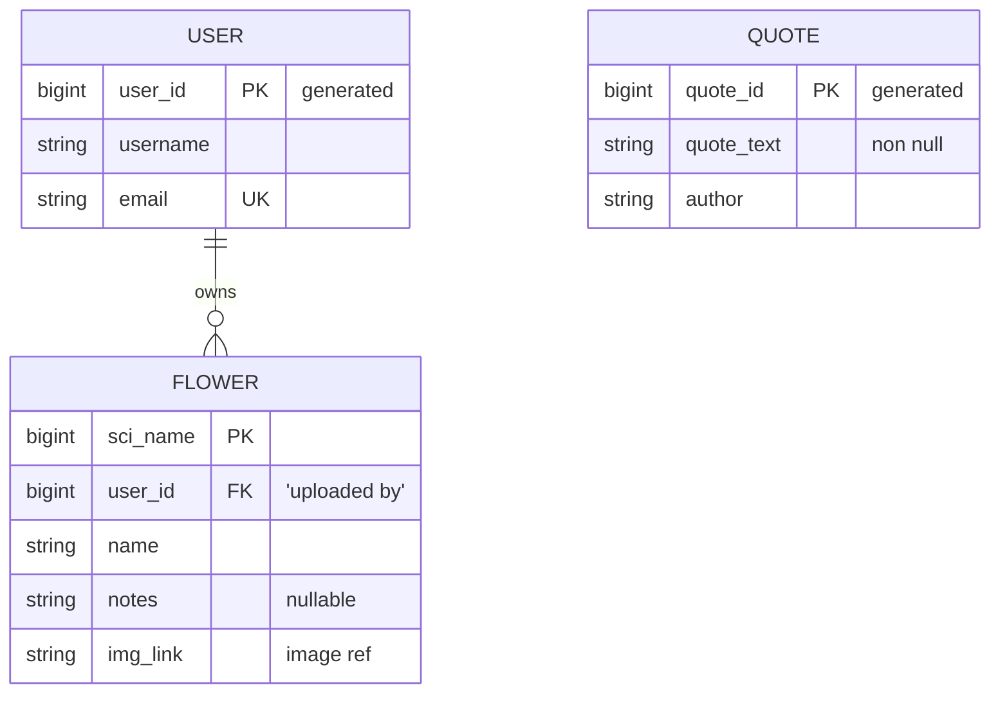

# FlowerAPI Proposal

## 1. The pitch (one paragraph)
What the API does, who uses it, and why a client app would need it.

## 2. Resources
| Resource | Key fields                                                     | Relationships                      |
|----------|----------------------------------------------------------------|------------------------------------|
| User     | user id, email, userame                                        | a User can upload many flowers     |
| Floweer  | scientific name, user (uploader) id, common name, notes, image | a flower is diaplyed with a quote  |
| Quote    | quotee id, quote text, author                                  | a quote is displayed with a flower |
| ...      | ...                                                            | ...                                |

## 3. ER sketch

## 4. Endpoints
| Verb | Path       | Auth | Purpose  |
|---|------------|---|----------|
| GET | /api/v1/temp | user | function |
| ... | ...        | ... | ...      |
Mark each endpoint `public`, `user`, or `admin`. Mark which collection paginates and which
filters or sorts.

## 5. Technical choices
- **Database host:** Railway -- natively supports PostgreSQL, which we have experience with
- **OAuth2 provider:** (Google, GitHub, Auth0) and confirmation that it supports Authorization Code + PKCE from a native app
- **Repo layout:** split repo -- recommended by Dr. C

## 6. Risks
The two things most likely to go wrong, and what you will do first to find out.

## 7. Team and Sprint 1
Who owns what in Sprint 1. Link your Project board and Sprint 1 milestone.
